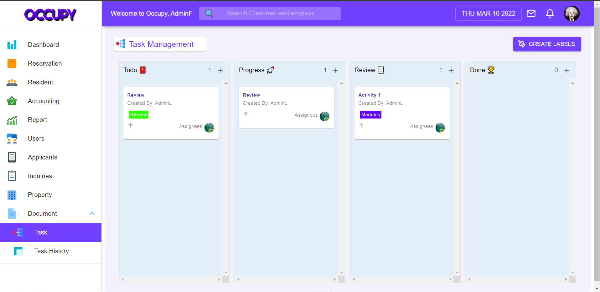

# Occupy

### This Repo is about the frontend of the software the we development during our Thesis. It is a Web-based Real Estate Management System with Sales Analysis and Customer Segmenation

## Some of Web Interface

### Reports 📈

### Task Management

### Accounting Management

### Document Management

### Resident Management

### Notifications

Visit Site: [https://www.occupy-rem.com](https://www.occupy-rem.com).

### The Technology the we used are:

### Frontend
- [x] Javascript
- [x] HTML
- [x] CSS
- [x] ReactJS
- [x] Redux
- [x] Material UI
- [x] React-Beautiful-Dnd ( Drag & Drop )

### Backend
- [x] Python
- [x] Django itself &
- [x] Django Rest Framework
- [x] Django ORM for Interacting with the database
- [x] Pusher ( Real Time )
- [x] PostgreSQL
 
### Others:
- [x] AWS S3
- [x] AWS RDS
- [x] Heroku 
- [x] AWS
- [x] Pandas ( Data Manipulation )
- [x] Scikit-Learn ( Machine Learning )

### Features🏆
- Managing and Monitoring multiple Software Modules like Resident, Reservation, Accounting, User, Document, Reports, Dashboards, User and Task Management
- Includes Portal for the Resident and Reserved Customer for their Balance and Property Monitoring
- Real time Notification and Messaging ( Needs to be improve )
- Update user profile and images
- CRUD Functionality
- Drag and Drop for Task Management
- Creating, Updating, Deleting and Assigning Task to employees / Staff with labels and priorities
- Able to send proof of payment
- Auto-Generated Downpayment and Monthly Amortization
- Email Verification for creating accounts
- Notification via SMS and Email using Django built in features and Twilio
- Uploading and Downloading documents / files 
- Includes Portal for the Real Estate Agent also to monitor the property the is available and the assigned Customer for the agent

**Occupy: Web-based Real Estate Management System** that helps the real estate industry to monitor all the transaction between the company and customer. It manage customer accounts, documents, users, residents, reserved customer and properties. It also has a Drag and Drop features for task management that staff and manager can work with by assigning and creating task for the employees, to implement this kind of features we used React Beautiful DND by Atlassian. We used Django for the backend which is a python based server side framework, since we used python, we also integrate machine learning using Decision tree for customer segmenation and ARIMA for the sales analysis/sales forecasting. For the real time features we use Pusher a real time services for our notification and messaging. Lastly we use AWS and Heroku for our cloud storage,databased and hosting.

## Note: *The Backend Repo Together with the Build Code of ReactJS are set as Private* ( it will set as public if it is done 😀 )
